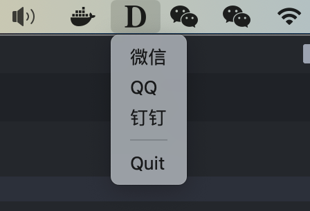

    

## macos 多开助手

支持 微信/QQ/钉钉, [Intel and M1 download](https://github.com/daodao97/DuoKai/releases)

### Tips 

只有一部手机时如何在手机端切换微信账号但mac端不退出

正常情况下如果在手机端切换账号, mac端已登录的微信会自动退出, 此时我们需要使用一点小小的技巧, 来达到手机端切换账号, mac端不退出的目的.

手机上的操作步骤: 
1. 关闭 蜂窝和WIFI
2. 微信->我的->设置->退出登录(显示正在加载, 大约2分钟, 不要动)
3. 当显示登录的页面时, 打开 蜂窝和WIFI
4. 登录页面->更多选项->登录其他微信 (记得勾选下自动登录, 以后不用这么麻烦了)
   
电脑端:
菜单栏点击多开图标->点击微信

然后即可扫码登录

